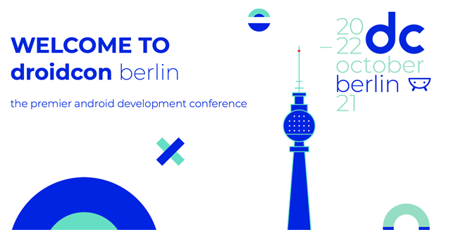

### Droidcon Berlin
I made it, I am back to conferences after the global pandemic. Last time I was in a Conference was in Copenhagen, December 2019, for the Kotlin Conf.
Almost two years have past and a lot has changed since then. But I am happy to be back on track!

The next three days will be packed with ton of amazing talks by top speakers. You could see more info in the [droidcon page.](https://www.berlin.droidcon.com/)

I will add an entry for each Day, where a will talk about all the talks I assist, what are my thoughts on them, and why I choose to go for those talks and not other ones.

