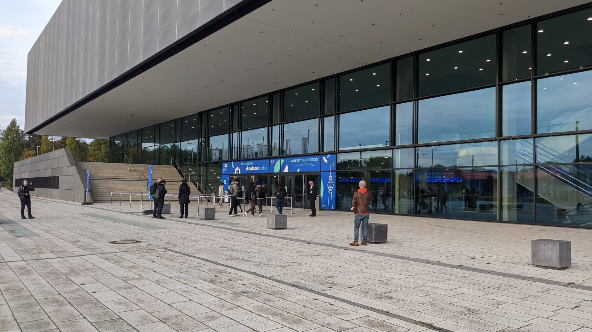
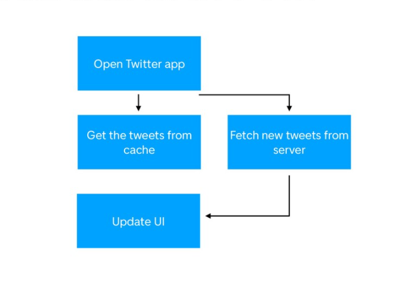
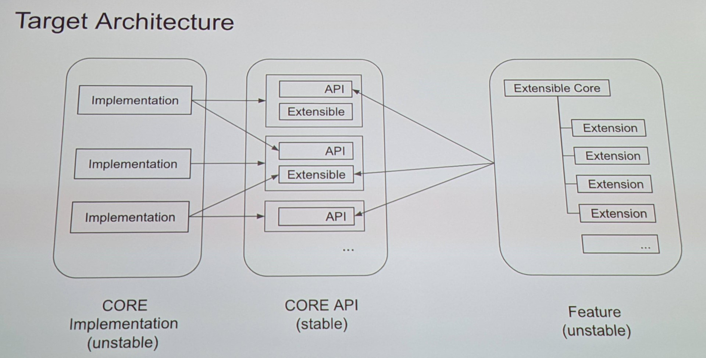
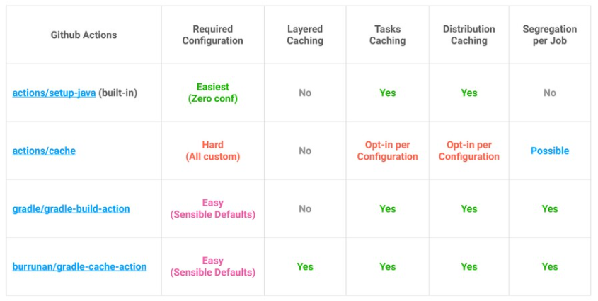

We were warned that, due to the speakers not being able to travel, some talks would be remote. I attended some of them on the second and the third day. I must say the experience was far from ideal. Laggy, with audio problems, and so on; which prevented us from enjoy the talks.

# Using Kotlin flow in MVVM
### by Fatih Girish

Was early morning, and we were tired from the day 1 marathon, but the first talk of the day that I choose was about one of the two big topics of the conference. 

### Kotlin Flow
A suspending function asynchronously returns a single value, but how can we return multiple asynchronously computed values? This is where Kotlin Flows come in.

Check the Flow [Documentation](https://kotlinlang.org/docs/flow.html) to know how is working. But here some Pros:
- Structured concurrency
- Cold stream
- Efficient data transformation
- Easy testing

# "Offline" is not an error
### by Yoni Levin
`Once upon a time in a conference far far away...`

Cool and dynamic talk about how [monday.com](https://monday.com/) implemented an architecture using room, flow and Workmanager to make the app work seamlessly in offline mode.

Yoni gave us a huge boost of energy, making everyone pay attention to the talk. He exudes energy.

# Keeping your Pixels Perfect
## Paparazzi 1.0
### by Joh Rodriguez

I think every Android Developer knows the open-source projects that Square and CashApp team have, at least the most important and common ones. In this talk John presented us, or should I say reintroduced us, to how the [Paparazzi](https://github.com/cashapp/paparazzi) works.

It is an Android library to render your application screens without a physical device or emulator.

Stable version 1.0 is almost there, he wanted to give it to us as a surprise in the conference, but there were some tests failing ;)
It was fascinating to see how they use this tool to test screens really fast without using emulators or devices.

One thing that stood out to me was the possibility to add the images generated to git and then be able to see differences. Never thought about this, great idea!

What I would love is to work in a company who is really involved in Open Sourcing tools.

# Scaling App development at Zalando
### by Volker Leck & Alexey Agapitov

In this talk, they presented their approach to migrate their Monolith App into an easy to maintain and easy to scale Architecture. Really nice to also see failures and timelines on the still ongoing migration.
If you are into Apps Architecture or you want to know more about how Zalando did it, check the Talk!

# Jetpack Compose for Games & Animations
### by Wajahat Karim

This talk was one of those I mention, which should be done remotely. I think the talk suffered a lot from that, and the fact that what I expected from it was not there, was a bit disappointing.
Nevertheless, I learn about how some animations could be implemented with Jetpack Compose.

Games / projects done with compose & animations:

- [Bees & Bombs](https://github.com/alexjlockwood/bees-and-bombs-compose)
- [2048](https://github.com/alexjlockwood/android-2048-compose)

# Automating Android Workflows
## with Github Actions
### by Ubiratan Soares

I use [Github Actions](https://docs.github.com/es/actions) to automate the building, the testing and the deployment of my apps in GitHub, both for my private and for my public Repos. And both for my Android Apps and for my Unity 3d games.

So I was happy to see that there was a talk covering not only the basics of it. It was a great talk, from where I learn a couple of tips for my projects. 
How to scale the Pipelines and how to use build matrix to 

# End of Day Two
Day two ended with popcorn, yes, kilos of popcorn. Ah! and also with a bad Movie = [Hackers](https://www.imdb.com/title/tt0113243/)

# Day Three
## Community Day!
I arrived in the fair room late, 8:50, or so I thought. I could tell the second day had already taken its toll on the people. So few were already there and the Kickoff was about to start. 

This day was full of surprises and for me, bad choices with talks, choosing two workshops I really wanted to attend, which were remote and on rooms without the possibility of charging the laptops...

After the Kickoff, any developer who wanted could pitch a talk to be presented that day. Amazing idea!

# A Comedy Talk
### by Chet Haase
This was the big surprise of the day, not the only one though ;). Chet did use his stand-up comedy skills to give a hilarious talk about... Scala XD

# Migrating your app to compose
## Step 1 - Live coding
### by Richard Schattauer

This talk was one of the community talks that were selected by us, the attendees. It was cool to see a live coding on Compose. We had been seeing a lot of talks about it, but not a single one with so in depth Live Coding. 

This one made me start migrating some of my projects to Compose. So thanks Richard!